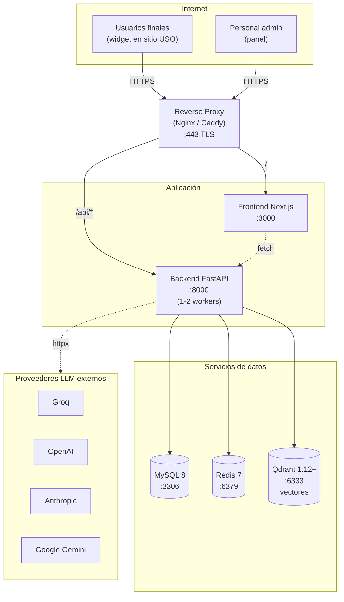
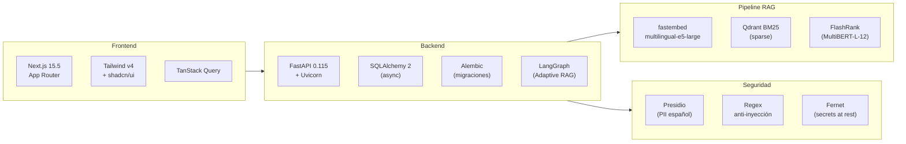
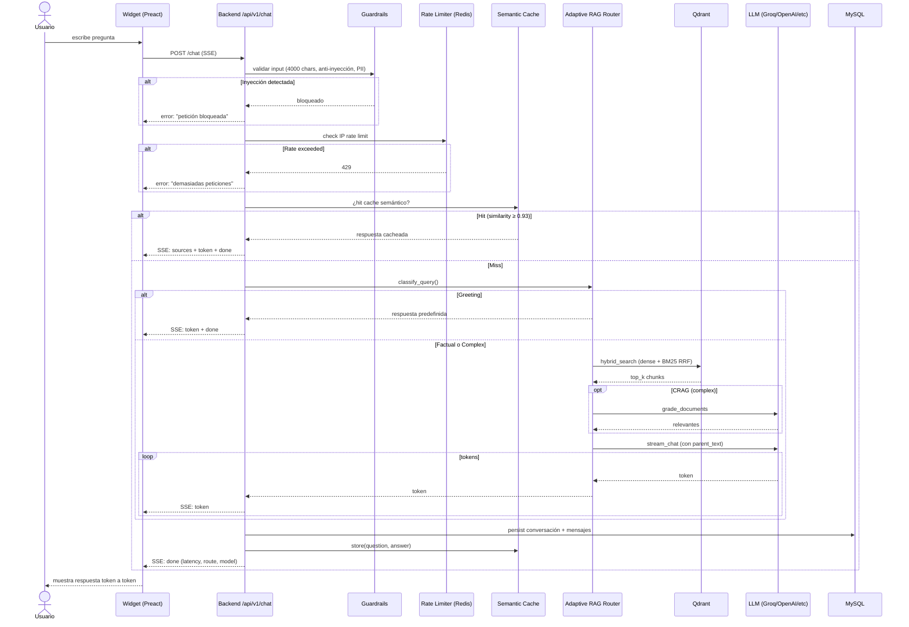
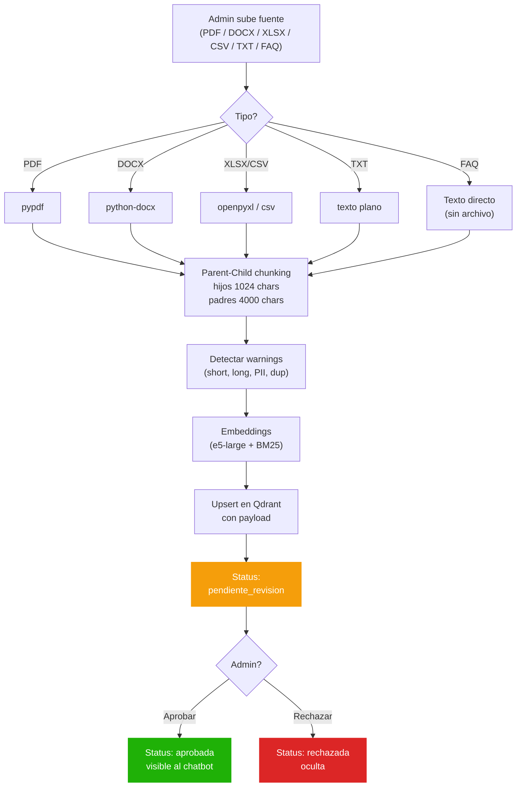
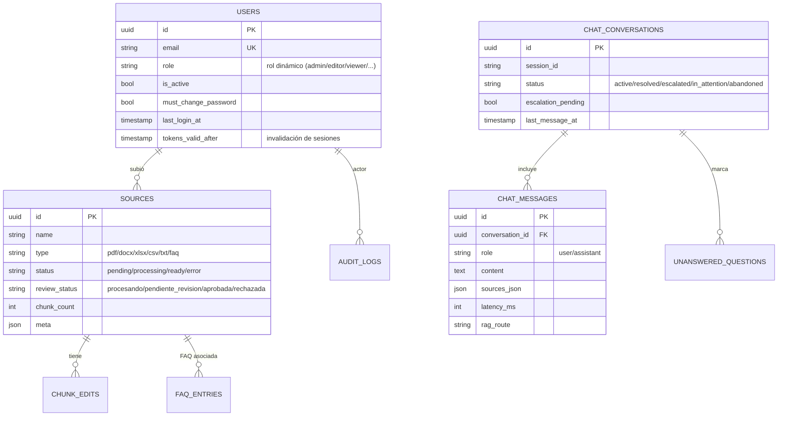
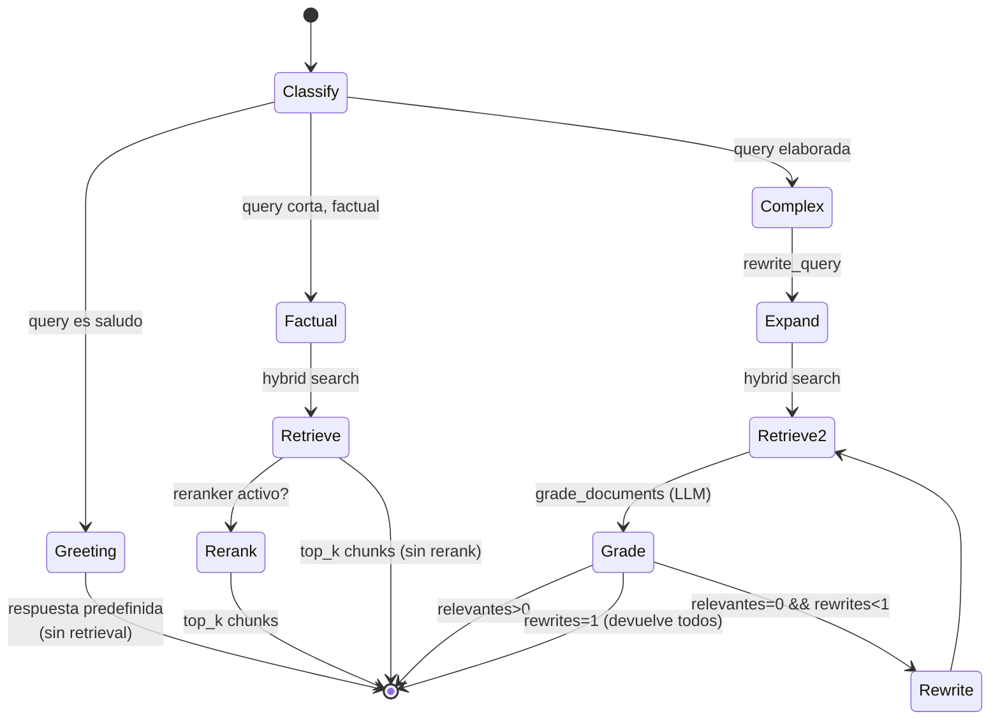

# Arquitectura

Diagramas y explicación del flujo interno del sistema.

---

## 1. Vista general del despliegue



**Reglas de exposición**:

- Solo el reverse proxy (puerto 443) está expuesto a internet.
- Backend, frontend y servicios de datos escuchan en `127.0.0.1` o red interna.
- Qdrant y MySQL requieren auth si se exponen a la red local.

---

## 2. Stack tecnológico



| Capa | Tecnología | Versión |
| --- | --- | --- |
| Backend | Python + FastAPI (Uvicorn) | 3.12 / 0.118 |
| ORM | SQLAlchemy async + Alembic | 2.0 |
| Base de datos | MySQL | 8.0 |
| Caché / rate-limit | Redis | 7 |
| Vector DB (cliente) | Qdrant | qdrant-client 1.13.3 |
| Embeddings densos | intfloat/multilingual-e5-large (fastembed) | 1024 dims |
| Embeddings sparse | Qdrant/bm25 (fastembed) | — |
| Reranker | ms-marco-MultiBERT-L-12 (FlashRank) | — |
| RAG | LangGraph Adaptive RAG | — |
| Frontend | Next.js 15 + Tailwind v4 + shadcn/ui | — |
| Widget | Preact + Shadow DOM | — |

---

## 3. Flujo de una pregunta del usuario (chat con RAG)



**Estados del request**:

- 1-4: validación de input (< 50 ms).
- 5: cache semántico (hit ratio esperado 30-60% post-warmup).
- 6-7: clasificación de la query y retrieval (200-800 ms).
- 8: streaming del LLM (1-30 s según modelo).

---

## 4. Pipeline de ingestión de fuentes



**Tiempos típicos** (fuente de 30 páginas PDF):

- Extracción: 2-5 s.
- Chunking: < 1 s (~500 chunks hijos).
- Embeddings: 8-15 s (CPU only).
- Upsert Qdrant: < 2 s.

**Nota sobre aprobación**: los documentos (PDF/DOCX/XLSX/CSV/TXT) quedan en estado `pendiente_revision` hasta que un admin los aprueba. Las FAQs creadas desde el panel se aprueban automáticamente.

---

## 5. Modelo de datos (resumen)



---

## 6. Adaptive RAG — máquina de estados



**Ahorro de tokens**:

- Greeting: 0 llamadas LLM, 0 retrievals.
- Factual: 1 llamada LLM (generación), 1 retrieval.
- Complex: 2-3 llamadas LLM (grade + opcional rewrite + generación).

---

## 7. Layout del repositorio

```text
chatbot-uso-v2/
├── backend/                FastAPI + SQLAlchemy + Alembic
│   ├── app/
│   │   ├── api/v1/         Endpoints (auth, sources, chat, analytics, ...)
│   │   ├── core/           config, security, deps, rate_limit, redis
│   │   ├── db/             session async
│   │   ├── models/         SQLAlchemy ORM
│   │   ├── schemas/        Pydantic
│   │   └── services/       Lógica de negocio
│   │       ├── chat/       pipeline.py (SSE + cache + scope)
│   │       ├── rag/        Adaptive RAG (corrective.py + router.py)
│   │       ├── ingestion/  chunking, embedding, vector_store
│   │       ├── knowledge/  faq.py
│   │       └── ai/         guardrails.py, semantic_cache.py, embedding.py
│   ├── alembic/versions/   Migraciones
│   └── tests/              pytest
│
├── frontend/               Next.js 15 + Tailwind v4
│   └── src/
│       ├── app/(dashboard)/    Páginas del panel
│       │   └── dashboard/
│       │       ├── configuracion/  Toda la administración, expuesta en el
│       │       │                   sidebar como grupos plegables: Chatbot,
│       │       │                   Sistema y Acceso
│       │       ├── conocimiento/   Gestión KB (documentos + FAQ)
│       │       ├── estadisticas/   Métricas y analytics
│       │       ├── reportes/       Reportes descargables en PDF
│       │       ├── conversaciones/ Historial y escalamientos
│       │       └── actividad/      Auditoría y seguridad
│       ├── components/             UI (shadcn)
│       └── hooks/, types/, lib/
│
└── widget/                 SDK Preact embebible (Shadow DOM)
```

---

## 8. Seguridad

| Mecanismo | Implementación |
| --- | --- |
| Autenticación | JWT (access + refresh) con rotación de refresh y detección de reuso |
| Invalidación de sesiones | Denylist de `jti` en Redis (logout) + `tokens_valid_after` por usuario (cambio de contraseña) |
| Autorización | RBAC dinámico en BD: roles y permisos `(módulo, acción)` configurables desde el panel |
| Contraseñas | bcrypt |
| Secretos en reposo | Cifrado Fernet (API keys de proveedores) con derivación PBKDF2-HMAC-SHA256 |
| Anti–fuerza bruta | Rate limit por IP en endpoints de auth (Redis, con fallback en memoria) |
| Guardrails de entrada | Detección de inyección de prompts por regex (built-in + personalizables) |
| Redacción de PII | Presidio en español: email, teléfono, tarjeta, IBAN + documentos de El Salvador (DUI, NIT, NRC) |
| Rate limiting del chat | Multidimensional: por IP/minuto, por IP/hora y por sesión |
| Widget público | Validación de API key + allowlist de dominios por `Origin` |
| IP real tras proxy | `CF-Connecting-IP` / `X-Real-IP` / `X-Forwarded-For` |

## 9. Notificaciones por correo

El sistema envía correo (SMTP, configurado por variables de entorno) en:

- **Invitaciones de usuario**: enlace de registro al correo del invitado.
- **Escalamientos**: aviso a los administradores cuando una conversación se escala.
- **Reglas de notificación**: eventos configurables (servicio caído, proveedor caído, etc.).

El envío es *best-effort*: un fallo de SMTP queda registrado pero no interrumpe la operación que lo originó.

## 10. Convención de configuración: fuente única

Cada ajuste tiene exactamente una fuente:

- **`.env`**: infraestructura y secretos (BD, Redis, Qdrant, SECRET_KEY, SMTP,
  OAuth, CORS, límites de auth) y la segmentación de documentos
  (`CHATBOT_CHUNK_*`, porque cambiarla exige reingestar).
- **Base de datos (panel)**: todo el comportamiento operable, con defaults en
  el código: parámetros del asistente, mensajes, cuotas del chat y caché
  semántico. El `.env` no participa en estos valores.

## 11. Convenciones de la interfaz

- El texto del panel de administración, los errores de la API y los correos emplea tratamiento formal de **usted**.
- El chatbot público y el widget **tutean** a propósito (el system prompt por defecto instruye "tutea al usuario") — es una decisión de producto para el público estudiantil.
- No se exponen detalles técnicos de configuración (rutas, variables de entorno, logs) en la interfaz.
- La terminología es en español: las acciones de valoración (👍/👎) se denominan «valoración», no «feedback».

## 12. Versionado de configuración

El sistema mantiene un historial de versiones de toda la configuración
(proveedores, asistente, widget, escalamiento, notificaciones, fuentes, FAQ)
como snapshots JSON en la tabla `config_versions`.

Las versiones se generan de tres formas:

- **Automática**: un middleware ASGI captura un snapshot tras cada mutación
  exitosa de configuración (sin añadir latencia a la respuesta — es
  *fire-and-forget*). Solo crea una versión nueva si hubo cambios reales
  respecto a la anterior.
- **Manual**: el administrador crea un punto de restauración explícito.
- **En despliegue**: al publicar a producción.

Los secretos (contraseñas SMTP, credenciales OAuth) se enmascaran en los
snapshots. Cualquier versión puede restaurarse (rollback).
